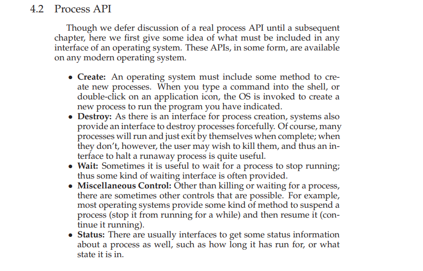

# AIS Vessel Map — Frontend

A real-time vessel tracking interface built with React. Connects to a live AIS (Automatic Identification System) feed over WebSocket, displays vessel positions on an interactive map, and updates continuously without a page refresh.

---

## What it does

- Displays all active vessels as icons on a Leaflet map, color-coded by vessel type (cargo, tanker, fishing, passenger, sailing)
- Connects to a WebSocket feed and applies live position updates to the map and sidebar in real time
- Shows a hover tooltip on every vessel marker with name, MMSI, type, speed, and last update time
- Sidebar lists all active vessels with a live "radar pulse" highlight whenever a vessel's position updates
- Clicking a vessel in the list or on the map opens a full detail panel — nav status, callsign, IMO, destination, ETA, draught, dimensions, and AIS class
- **Bounds mode** — toggle to filter the vessel list to only what's currently visible in the map viewport. The list updates as you pan or zoom
- View mode (`?mode=bounds`) is persisted in the URL — shareable and survives a page refresh

---

## Tech stack

| Concern            | Library                 |
| ------------------ | ----------------------- |
| UI                 | React 18 + TypeScript   |
| Styling            | styled-components       |
| Map                | Leaflet + react-leaflet |
| Data fetching      | TanStack Query v5       |
| Runtime validation | Zod                     |
| Routing            | React Router v6         |
| Build              | Vite                    |

---

## Prerequisites

- Node.js 18 or higher
- npm 9 or higher
- The backend API running locally (see the backend README)

---

## Getting started

**1. Clone the repository**

```bash
git clone <your-repo-url>
cd ais-vessel-map-frontend
```

**2. Install dependencies**

```bash
npm install
```

**3. Configure environment variables**

Copy the example env file and fill in your values:

```bash
cp .env.example .env
```

Open `.env` and set:

```
VITE_API_BASE_URL=http://localhost:3000
VITE_WS_URL=ws://localhost:3000/ws/vessels
```

Both values above are the defaults for a locally running backend. If your backend runs on a different port, update them here.

**4. Start the development server**

```bash
npm run dev
```

Open [http://localhost:5173](http://localhost:5173) in your browser.

---

## Environment variables

| Variable            | Required | Description                                 |
| ------------------- | -------- | ------------------------------------------- |
| `VITE_API_BASE_URL` | Yes      | Base URL for the REST API                   |
| `VITE_WS_URL`       | Yes      | WebSocket endpoint for the live vessel feed |

All variables must be prefixed with `VITE_` — Vite only exposes variables with this prefix to the browser bundle.

---

## Project structure

```
src/
├── app/                     # Router, providers, app-level wiring
│   ├── providers/
│   └── root.tsx
├── pages/
│   └── vessel-tracker/      # Route entry point — one line, renders the feature
├── features/
│   ├── vessel-tracker/      # Orchestrator — wires all leaf features together
│   ├── vessel-feed/         # Sidebar list and header
│   ├── vessel-map/          # Leaflet map, markers, tooltip, bounds tracking
│   ├── vessel-details/      # Detail panel for a selected vessel
│   └── vessel-view-mode/    # All/bounds toggle, persisted in URL
├── entities/
│   └── vessel/
│       ├── api/             # Typed fetch functions (getAllVessels, getVesselDetail, getVesselsInBounds)
│       ├── hooks/           # useVessels, useVesselWebSocket, useRecentlyUpdated, useVesselsInBounds
│       ├── lib/             # applyWsEvent reducer, constants
│       ├── types/           # Zod schemas + inferred TypeScript types
│       └── utils/           # bounds helpers, display formatters
└── shared/
    ├── api/                 # ApiError class, API_BASE constant
    ├── hooks/               # useToggle
    └── ui/                  # Sidebar, Toggle — zero domain knowledge
```

The layers follow a strict one-way dependency rule:

```
app → pages → features → entities → shared
```

A layer can only import from layers below it. This is enforced at lint time with `eslint-plugin-boundaries` — a cross-layer import in the wrong direction is a lint error, not just a convention.

---

## Architecture decisions

### Real-time data flow

The REST endpoint (`GET /api/vessels`) is fetched once on load to populate the initial view before the WebSocket has opened. After that, the WebSocket is the single source of truth. The server sends a full `vessel:snapshot` event on every connection — including reconnects — so the cache is always replaced wholesale on reconnect rather than patched on top of potentially stale data. No manual re-fetch is ever triggered on reconnect.

Three WebSocket event types are handled:

- `vessel:snapshot` — replaces the entire vessel list (sent on connect/reconnect)
- `vessel:updated` — patches a single vessel in place
- `vessel:created` — prepends a new vessel to the list

### Runtime validation

Every API response is validated with Zod before it touches the React Query cache. This means a schema mismatch between the backend and frontend fails loudly at the boundary with a descriptive error, rather than silently corrupting UI state with a malformed object.

All Zod schemas and their inferred TypeScript types live in `vessel.types.ts` — the compile-time type and the runtime validator are derived from the same definition and can never drift from each other.

### Error handling

All fetch functions throw `ApiError`, a typed error class with a `status` field. This makes `useQuery<T, ApiError>` an honest contract — consumers can safely narrow on `error.isNotFound`, `error.isNetworkFailure`, or `error.isServerError` without `instanceof` checks. Three failure cases are distinguished: network failure before the server was reached (status `0`), HTTP error responses, and malformed response bodies.

### Component design — Consumer Experience vs. Producer Experience

## Consumer Experience vs. Producer Experience

In a longer-lived application, the stuff that often makes the difference between a React application that feels maintainable vs. one that doesn't is this idea:

> **The consumer experience is often much more important than the producer experience.**

When I was introduced with this idea first time, I continuously getting a feel for it. Take a look at this screenshot. It is from the book called _Operating System: Three Easy Pieces_:



Operating System Codebase is a closed system. From a consumer point of view, none of it directly accessible. Instead, consumers interface with the OS through system calls (APIs) just like the paragraph emphasize.

This is a really common thing in software. Every time we `npm install` a package, we consume a chunk of code that another developer has produced.

The realization I had is that React components are closed systems, just like Twitter.

Each component is a bundle of markup, styles, and logic, and from the consumer point of view, none of it is directly accessible. Instead, consumers interface with React components through props.

When we produce React components, we control what the props are, what the props do, what props are not included… This is a tremendous amount of power, an opportunity to make something really good, or really bad.

And so for that reason, I think, we should be really intentional about the way we set up the props for our components.

### Bounds mode

When bounds mode is active, the initial vessel list for the current viewport is seeded by a server-side bounds query (`GET /api/vessels/in-bounds`). Once the live WebSocket snapshot loads, the map switches to filtering the full live list client-side with `filterToBounds`. This means panning and zooming in bounds mode never triggers a network request — the filter runs against data already in the cache.

Bounds are rounded to three decimal places (~100m) before becoming a query key, so minor map jitter doesn't produce cache misses.

### WebSocket reconnection

The WebSocket hook reconnects automatically with exponential backoff (capped at a maximum delay). A `destroyed` flag ensures no reconnect is scheduled after the component unmounts. The `onEvent` callback is stored in a ref so the effect never needs to be re-run when the handler changes — the socket stays open across re-renders.

---

## Available scripts

| Script               | Description                                    |
| -------------------- | ---------------------------------------------- |
| `npm run dev`        | Start the development server                   |
| `npm run build`      | Production build                               |
| `npm run preview`    | Preview the production build locally           |
| `npm run lint`       | Run ESLint                                     |
| `npm run type-check` | Run TypeScript compiler check without emitting |
