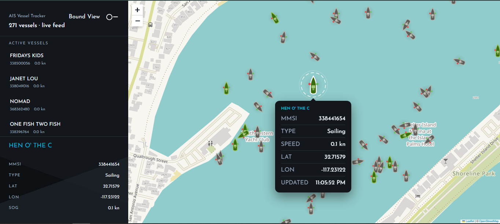

# AIS Vessel Map — Frontend

A real-time map that shows vessels moving around a harbor as they actually move — built with React, Leaflet, and a WebSocket connection to an AIS (Automatic Identification System) feed.



### Demo Video

Watch the complete application demo here:

[▶ Watch Demo Video](./docs/demo/AIS-Vessel-Map-demo.mp4)

The video demonstrates:

- AIS vessels displayed on the interactive map
- Hover tooltip functionality
- Real-time vessel position updates
- Map interactions such as zooming and panning
- displaying only vessels within the visible area

---

## What it does

- Shows every tracked vessel as a marker on an interactive map, colored and rotated by vessel type and heading.
- Updates marker positions live, over a WebSocket, as new AIS data comes in — no polling, no page refresh.
- Hovering a vessel shows a floating tooltip with its name, MMSI, type, speed, position, and last-seen time.
- Clicking a vessel opens a detail panel and smoothly flies the map to it.
- Newly updated vessels get a brief "pulse" so you can actually see where the activity is happening.
- If the WebSocket drops, it reconnects on its own with backoff, and resyncs from a fresh snapshot.

That covers the assignment's core requirements. The sections below cover the parts I added on top of that.

---

## Beyond the requirements

A few decisions worth calling out, because they're the kind of thing that's easy to skip on a take-home but matters in a real product:

**The map never lies about vessel state.**
Every payload coming off the wire — REST responses and WebSocket frames alike — is validated at runtime with [Zod](https://zod.dev), not just typed at compile time. A malformed WebSocket frame gets silently dropped instead of corrupting the map. TypeScript types are _derived_ from the Zod schemas (`z.infer`), so the runtime shape and the compile-time type can't drift apart — one source of truth instead of two definitions someone has to remember to keep in sync.

**Hovering a moving marker doesn't flicker.**
A vessel marker slides around on every position update. If you naively listen to `mouseout`, a marker sliding out from under a stationary cursor fires it — even though the user's intent hasn't changed — and the tooltip flickers open and shut. `useHoverWithGrace` treats "hover start" as immediate but debounces "hover end" by 250ms, so a quick re-hover on the same target cancels the pending close.

**The WebSocket recovers from failure gracefully.**
`useVesselWebSocket` reconnects with exponential backoff (capped at 30s) instead of hammering the server every second when it's down. Reconnection logic lives in a single place (`onclose`), rather than being split across `onerror` and `onclose` — the two aren't guaranteed to agree on ordering across every runtime, so keeping one source of truth avoids a class of race conditions entirely.

**You can lock the feed to a viewport.**
Beyond just "show everything," there's an optional bounds mode: drag or zoom the map, and it fetches only the vessels in view, encoding the bounds into the URL so a refreshed or shared link restores the same view. Bounds are rounded to a coarse grid before they become a query key, so a one-pixel drag doesn't spam refetches.

**The initial bundle doesn't wait on the map library.**
Leaflet is genuinely heavy — about 54KB gzipped on its own — and none of it is needed to render the sidebar or the loading state. It's lazy-loaded with `React.lazy` and `Suspense`, and the Vite/Rolldown build splits it into its own chunk. That took the JavaScript needed for first paint from 170KB down to about 91KB (a 46% cut). The full writeup, with before/after numbers, is in [`docs/bundle-splitting.md`](./docs/bundle-splitting.md).

**Errors are caught at two levels, not one.**
A global error boundary catches catastrophic failures (bad initial render, broken providers). A second, page-level boundary wraps just the vessel tracker, so a bug in the map doesn't take down the entire app shell — the user gets a "try again" button scoped to what actually broke.

**The codebase is organized so nothing can quietly become spaghetti.**
More on this in the [architecture](#architecture) section below — but in short, features can't reach into each other's internals, and the boundary is enforced by `eslint-plugin-boundaries`, not just convention.

---

## Tech stack

| Layer               | Choice                                                            |
| ------------------- | ----------------------------------------------------------------- |
| Framework           | React 18 + TypeScript                                             |
| Build tool          | Vite (Rolldown)                                                   |
| Map                 | React Leaflet, tiles from OpenStreetMap (free, no API key)        |
| Server state        | TanStack Query                                                    |
| Real-time           | Native WebSocket, with a hand-rolled reconnect/backoff hook       |
| Validation          | Zod (shared schemas for REST responses and WS events)             |
| Styling             | styled-components, CSS custom properties for theming (light/dark) |
| Tooltip positioning | Floating UI                                                       |
| Routing             | React Router                                                      |

---

## Getting started

### 1. Clone the repo

```bash
git clone https://github.com/rajib18197/ais-vessel-map-frontend.git
cd ais-vessel-map-frontend
```

### 2. Install dependencies

Requires Node.js 20.19+ or 22.12+ (Vite 8's minimum).

```bash
npm install
```

### 3. Configure environment variables

Copy the example env file:

```bash
cp .env.example .env
```

`.env.example` already ships with sane local defaults, so you shouldn't need to edit anything unless your backend runs somewhere other than `localhost:3000`:

```env
VITE_API_BASE_URL=http://localhost:3000
VITE_WS_URL=ws://localhost:3000/ws/vessels
```

### 4. Run the backend

This repo is the frontend only — it expects a backend serving `/api/vessels` and a `/ws/vessels` WebSocket at the URL above. Clone and run that repo first; see its README for setup. Without it running, the app will load but show "Connecting to AIS feed…" indefinitely.

### 5. Run the frontend

```bash
npm run dev
```

Then open `http://localhost:5173`.

### 6. Build for production

```bash
npm run build
npm run preview   # sanity-check the production build locally
```

## Talking to the backend

The frontend expects three things from the backend, all defined in `src/entities/vessel/types/vessel.types.ts` as Zod schemas:

**`GET /api/vessels`** — every tracked vessel, for the initial page load.

**`GET /api/vessels/:mmsi`** — extended detail for one vessel (nav status, callsign, IMO, destination, ETA, dimensions), fetched lazily when a vessel is selected.

**A WebSocket at `/ws/vessels`** — pushes one of three event types:

```ts
{ event: "vessel:snapshot", data: VesselSummary[] }  // sent on every connect/reconnect
{ event: "vessel:created",  data: VesselSummary   }  // a new vessel joined the feed
{ event: "vessel:updated",  data: VesselSummary   }  // an existing vessel's position/data changed
```

Sending a full `vessel:snapshot` on every connect (including reconnects) is what makes resync-after-disconnect work for free — the frontend never needs to manually invalidate and refetch over REST, since a fresh snapshot is already on its way over the socket.

Optionally, `GET /api/vessels/in-bounds?swLng=&swLat=&neLng=&neLat=` powers the viewport-locked bounds mode.

All coordinates follow the GeoJSON convention: `[longitude, latitude]`. Leaflet expects the opposite order, so the conversion happens in exactly one place (`getLatLon`) rather than being repeated at every call site.

---

## Architecture

The code follows a **Feature-Sliced Design**-style layering, where each layer can only import from the layer below it:

```
app → pages → features → entities → shared
```

| Layer      | Lives in        | Holds                                                                   |
| ---------- | --------------- | ----------------------------------------------------------------------- |
| `app`      | `src/app/`      | Router, providers, app-level wiring                                     |
| `pages`    | `src/pages/`    | Route components — orchestration only, no real logic                    |
| `features` | `src/features/` | Self-contained feature modules (map, feed, details, tracker, view-mode) |
| `entities` | `src/entities/` | Domain types, API calls, domain hooks — shared across features          |
| `shared`   | `src/shared/`   | Generic UI and utils with zero domain knowledge                         |

The rule that matters most in practice: **a feature can't reach into another feature's internals.** Cross-feature imports have to go through that feature's `index.ts` barrel, which only exports its intentional public surface. Internally, a feature imports its own files directly, skipping its own barrel. This is enforced by `eslint-plugin-boundaries`, so it's a build-breaking rule, not a suggestion in a wiki someone forgets to read.

The reasoning behind that — and the "consumer experience vs. producer experience" idea it's built on — is written up in [`docs/component-design-philosophy.md`](./docs/component-design-philosophy.md). Short version: a React component is a closed system, the same way an operating system is to the programs running on it. Consumers only ever touch it through props, never through its internals — so the props you expose are worth designing deliberately.

### How a vessel gets from the socket to the screen

1. `useVesselWebSocket` owns the raw connection — parsing, dispatch, reconnect. It knows nothing about React Query or vessel state; it just calls `onEvent` for every well-formed message.
2. `useVessels` wires that hook up to TanStack Query. Every event runs through `applyWsEvent`, a pure reducer that folds one event into the current vessel list without mutating anything.
3. `useVesselTracker` composes `useVessels` with selection state and bounds mode, and exposes a clean, minimal interface to the page.
4. `VesselTracker` (the page-level feature) renders the sidebar and the map from that interface, and nothing else.

Each layer only knows about the one below it, which is what makes it possible to, say, swap out TanStack Query later without touching the WebSocket hook at all.

### The map itself

`MapCanvas` composes several small, single-purpose components that each own one job inside Leaflet's map context: `MapInitialView` fits the map to wherever the vessel data actually is on first load, `MapRestoreBounds` restores a bounds mode saved in the URL, `MapAutoPan` flies to a newly selected vessel, and `MapBoundsTracker` reports viewport changes back up (debounced) for bounds mode. Splitting these apart instead of cramming them into `MapCanvas` directly means each one can be reasoned about — and tested — in isolation.

---

## Project structure

```text
src/
  app/           # router, global providers
  pages/         # route-level components
  features/
    vessel-map/         # the Leaflet map, markers, tooltips, auto-pan, bounds tracking
    vessel-feed/         # the sidebar vessel list
    vessel-details/      # the detail panel for a selected vessel
    vessel-tracker/      # composes the above into the main screen
    vessel-view-mode/    # "all vessels" vs "bounds" mode toggle
  entities/
    vessel/
      types/       # Zod schemas + inferred types (single source of truth)
      api/         # fetch functions, one per endpoint
      hooks/       # domain-level hooks (useVessels, useVesselDetail, ...)
      lib/         # pure domain logic (vessel theming, WS event reducer)
      utils/       # formatting helpers
  shared/
    api/         # API_BASE, WS_URL, the shared ApiError class
    ui/          # generic UI primitives (Button, Sidebar, error fallbacks)
  styles/        # global styles and design tokens
docs/
  architecture.md
  bundle-splitting.md
  component-design-philosophy.md
```

---

## Notes

- Vessel type codes follow ITU-R M.1371 (the AIS spec). The lookup table in `vessel-theme.ts` covers the ranges that map to a distinct marker color — it's intentionally not exhaustive of the full spec.

- The map defaults to a fallback center/zoom, but re-fits itself to the actual vessel data the first time positions arrive, so the fallback only matters for the first second or two of a cold load.
